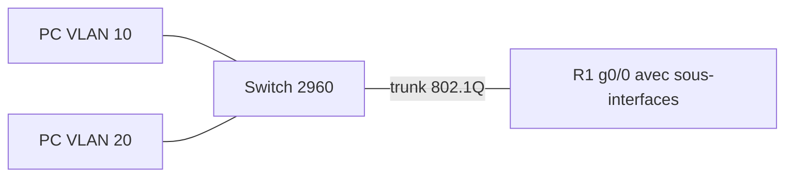

# Lab Cisco : routage inter-VLAN (router on a stick) et DHCP

> **Statut : à réaliser.** Ce guide est préparé à partir de la documentation officielle et de mes cours ; **je ne l'ai pas encore rejoué de bout en bout**. Les commandes sont à valider en le faisant, et le journal en bas de page sera complété avec mes résultats réels (captures, erreurs rencontrées, corrections).

## Objectif

Faire communiquer deux VLAN avec **un seul routeur et un seul câble** vers le switch (*router on a stick*), puis leur distribuer des adresses automatiquement avec **DHCP** sur le routeur.

Ce lab prolonge [labs-reseau-cisco](https://github.com/mehdiseg/labs-reseau-cisco), qui traite la commutation (VLAN, trunk, port-security) : ici, on ajoute le **routage entre VLAN**.

## Prérequis

- Cisco Packet Tracer (routeur 2911, switch 2960).
- Avoir compris ce qu'est un VLAN et un port trunk 802.1Q.

## Topologie



## Plan d'adressage

| VLAN | Nom | Réseau | Passerelle (sous-interface) |
|---|---|---|---|
| 10 | POSTES | 192.168.10.0/24 | 192.168.10.1 (g0/0.10) |
| 20 | SERVEURS | 192.168.20.0/24 | 192.168.20.1 (g0/0.20) |

## Étapes

### 1. Le switch : VLAN, ports d'accès et trunk

Fichier du dépôt : [`configs/SW1.txt`](configs/SW1.txt)

```text
enable
configure terminal
hostname SW1
vlan 10
 name POSTES
vlan 20
 name SERVEURS
interface f0/1
 switchport mode access
 switchport access vlan 10
interface f0/2
 switchport mode access
 switchport access vlan 20
interface g0/1
 switchport mode trunk
 switchport trunk allowed vlan 10,20
end
write memory
```

Sur un switch qui gère aussi ISL (par exemple un 3560), ajouter `switchport trunk encapsulation dot1q` avant `switchport mode trunk`.

### 2. Le routeur : une sous-interface par VLAN

Fichier du dépôt : [`configs/R1.txt`](configs/R1.txt)

```text
enable
configure terminal
hostname R1
interface g0/0
 no shutdown
!
interface g0/0.10
 encapsulation dot1Q 10
 ip address 192.168.10.1 255.255.255.0
interface g0/0.20
 encapsulation dot1Q 20
 ip address 192.168.20.1 255.255.255.0
!
ip dhcp excluded-address 192.168.10.1 192.168.10.10
ip dhcp excluded-address 192.168.20.1 192.168.20.10
ip dhcp pool POSTES
 network 192.168.10.0 255.255.255.0
 default-router 192.168.10.1
 dns-server 8.8.8.8
ip dhcp pool SERVEURS
 network 192.168.20.0 255.255.255.0
 default-router 192.168.20.1
 dns-server 8.8.8.8
end
write memory
```

L'interface physique `g0/0` n'a **pas d'adresse IP** : elle porte les sous-interfaces. Le numéro après `encapsulation dot1Q` doit correspondre au VLAN. Le trafic de deux VLAN passe par le même câble : la bande passante du trunk est partagée, c'est la limite de cette architecture.

### 3. Mettre les PC en DHCP

Sur chaque PC : *IP Configuration → DHCP*. Chaque PC doit recevoir une adresse de son VLAN (à partir de `.11`) et la bonne passerelle.

## Vérifications

```text
show vlan brief              ! VLAN 10 et 20, ports affectés
show interfaces trunk        ! g0/1 en trunk, VLAN 10,20 autorisés
show ip interface brief      ! sous-interfaces g0/0.10 et g0/0.20 « up »
show ip route                ! deux réseaux connectés (C) 192.168.10.0 et 192.168.20.0
show ip dhcp binding         ! les adresses louées
ping 192.168.20.11           ! depuis un PC du VLAN 10 : doit répondre, via le routeur
tracert 192.168.20.11        ! premier saut : 192.168.10.1
```

## Pièges fréquents

- Sous-interface sans `encapsulation dot1Q <n>` : elle reste inutilisable.
- Trunk qui n'autorise pas le VLAN (`switchport trunk allowed vlan`).
- `no shutdown` oublié sur l'interface physique (les sous-interfaces restent *down*).
- Un seul pool DHCP alors que deux VLAN : le second VLAN ne reçoit rien (sans `ip helper-address`, le DHCP ne traverse pas un routeur).

## Pour aller plus loin

- Ajouter une **ACL** qui empêche le VLAN 10 d'accéder au VLAN 20 sauf pour le port 80.
- Remplacer le routeur par un **switch de niveau 3** avec des interfaces `interface vlan 10` (`ip routing`).
- Placer le DHCP sur un serveur distinct et utiliser `ip helper-address` sur les sous-interfaces.
- Ajouter un VLAN de management (99) et un VLAN natif différent de 1.

## Références

- [RFC 2131 : Dynamic Host Configuration Protocol](https://www.rfc-editor.org/rfc/rfc2131)

## Journal de réalisation

_Lab pas encore réalisé : cette section sera remplie au fur et à mesure._

| Date | Ce que j'ai fait | Résultat | Difficultés et solutions |
|---|---|---|---|
|  |  |  |  |

## Feuille de route

Ce lab fait partie de ma [feuille de route réseau](https://github.com/mehdiseg/roadmap-reseau-bts-sio).
